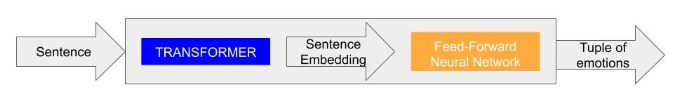
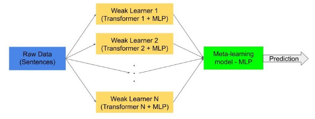

# Text Classifier for Emotion Recognition v2.0

#### Author
- Wilfredo Graterol

#### Revision by
- Arturo yepez

# Description

For social robots, knowledge regarding human emotional states is an essential part of adapting their behavior or associating emotions to other entities. They can gather the information from which emotion detection is processed via different media, such as text, speech, images, or videos.

A framework is proposed to allow social robots to detect emotion and to store this information in semantic repositories, based on EMONTO (an EMotion ONTOlogy).

As a proof-of-concept, it was developed a first version of this framework focused on emotion detection in text, which can be obtained directly as text or by converting speech to text.

Currently, the first version was revised into the current implementation were the main focus was to made the process of training more dynamic to allow experimentation or changes in the models/databases without too much effort.

## Architecture

According to the multimedia data considered, a wide range of emotion detection techniques can be implemented, mostly based on machine learning models.

The emotion detection task was approached as a multi-label classification problem, modeled with a Transformer architecture and meta-learning. Eleven emotions were considered: *anger*, *anticipation*, *disgust*, *fear*, *joy*, *love*, *optimism*, *pessimism*, *sadness*, *surprise*, and *trust*.

The classification task consisted of labeling a text as "*neutral or no emotion*" or as one or more of the previously mentioned emotioned, i.e., a binary vector indicating if each emotion was detected (1) or not (0).

Using the previously mentioned Transformers, a stacked ensemble architecture was designed:
* Each *Weak Learner* consists of a transformer, used to create a sentence embedding and a Multi-Layer Perceptron (MLP) with two hidden layers.



* The Meta-Learning consists of an mLP with one hidden layer.




# Setup

## Python Environment

First, we have to make sure to have a Python environment for development or testing since its the recommended way to ensure the consistency when working with many different environments.

In order to create a new environment we use the following command:
```bash
python3 -m venv ./venv
```

After that, we enter the environment with the following command from the root of the repository:
```bash
# Linux / Unix
source venv/bin/activate

# Windows
./venv/Scripts/activate
```

Finally, we install the recommended packages with the following command:
```bash
python3 -m pip install -r requirements.txt
```

When we finish to work on the project, let's make sure to deactivate the environment with the following command:
```bash
deactivate
```
